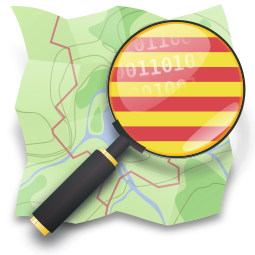

<!-- README.md is generated from README.Rmd. Please edit that file -->



# monitorOSM

<!-- badges: start -->

[](https://github.com/OSM-Catalan/monitorOSM/actions/workflows/quarto-publish.yml)
[](https://github.com/OSM-Catalan/monitorOSM/actions/workflows/pre-commit.yaml)
[](https://github.com/OSM-Catalan/monitorOSM/actions/workflows/R-CMD-check.yaml)
<!-- [](https://github.com/OSM-Catalan/monitorOSM/actions/workflows/test-coverage.yaml) -->

<!-- badges: end -->

`monitorOSM` és un repositori que serveix per monitoritzar canvis a
[OpenStreetMap](http://www.openstreemap.com) comparant els objectes amb
[bases de dades de
referència](https://github.com/OSM-Catalan/monitorOSM/tree/main/data-raw).

Podeu veure els informes que s’actualitzen diàriament a
<https://osm-catalan.github.io/monitorOSM>. Els informes de canvis
mostren taules amb l’estat de les etiquetes a OSM i a les bases de dades
de referència:

<table class="gmisc_table" style="border-collapse: collapse; margin-top: 1em; margin-bottom: 1em;">
<thead>
<tr>
<th style="font-weight: 900; border-bottom: 1px solid grey; border-top: 2px solid grey; text-align: center;">
osm_url
</th>
<th style="font-weight: 900; border-bottom: 1px solid grey; border-top: 2px solid grey; text-align: center;">
canvi
</th>
<th style="font-weight: 900; border-bottom: 1px solid grey; border-top: 2px solid grey; text-align: center;">
name:ca
</th>
<th style="font-weight: 900; border-bottom: 1px solid grey; border-top: 2px solid grey; text-align: center;">
name
</th>
<th style="font-weight: 900; border-bottom: 1px solid grey; border-top: 2px solid grey; text-align: center;">
wikipedia
</th>
</tr>
</thead>
<tbody>
<tr style="background-color: #ffffff;">
<td style="padding: .2em; color: #999999; background-color: #ffffff; text-align: center;">
<http://osm.org/node/XXXX>
</td>
<td style="padding: .2em; color: #52854C; background-color: #ffffff; text-align: center;">
\+
</td>
<td style="padding: .2em; color: #52854C; background-color: #ffffff; text-align: center;">
nom a OSM
</td>
<td style="padding: .2em; color: #999999; background-color: #ffffff; text-align: center;">
Sense canvis
</td>
<td style="padding: .2em; color: #52854C; background-color: #ffffff; text-align: center;">
</td>
</tr>
<tr style="background-color: #ffffff;">
<td style="padding: .2em; color: #999999; background-color: #ffffff; border-bottom: 2px solid grey; text-align: center;">
<http://osm.org/node/XXXX>
</td>
<td style="padding: .2em; color: #FC4E07; background-color: #ffffff; border-bottom: 2px solid grey; text-align: center;">
\-
</td>
<td style="padding: .2em; color: #FC4E07; background-color: #ffffff; border-bottom: 2px solid grey; text-align: center;">
nom de referència
</td>
<td style="padding: .2em; color: #999999; background-color: #ffffff; border-bottom: 2px solid grey; text-align: center;">
Sense canvis
</td>
<td style="padding: .2em; color: #FC4E07; background-color: #ffffff; border-bottom: 2px solid grey; text-align: center;">
ca:Eliminat
</td>
</tr>
</tbody>
</table>

També es mostra quins conjunts de canvis han trencat les etiquetes amb
enllaços per si es vol deixar comentaris.

## Afegir nous objectes a les bases de dades

Si voleu afegir objectes amb les seves etiquetes a les bases de dades,
podeu obrir un
[tiquet](https://github.com/OSM-Catalan/monitorOSM/issues). Fora bo que
els estats de referència dels objectes siguin consensuats amb la
[Comunitat d’OpenStreetmap en
català](https://wiki.openstreetmap.org/wiki/WikiProject_Catalan#Canals_de_comunicaci%C3%B3_i_mitjans_de_difusi%C3%B3).

## Paquet d’R

La consulta, comparació amb bases de dades de referència i renderització
de la web es fan amb un paquet d’[R](https://cran.r-project.org/) i
accions de github. El paquet també inclou funcions per restaurar els
objectes de manera ràpida, però com a projecte comunitari, és important
intentar parlar amb els usuaris que discrepen de les bases de dades de
referència.

### Exemple de restauració

Instal·leu el paquet d’R:

``` r
# install.packages("devtools")
devtools::install_github("OSM-Catalan/monitorOSM")
```

Restauració de les etiquetes `name` i `wikipedia` de les comarques del
País Valencià:

``` r
library(monitorOSM)

id <- modifica_etiquetes_osm(
  comarques[comarques$regio == "PV", ],
  claus = c("name", "wikipedia"),
  comentari = "Restaura els noms de les comarques dels País Valencià", hashtags = "monitorOSM"
)
```

Retorna l’identificador del conjunt de canvis.
